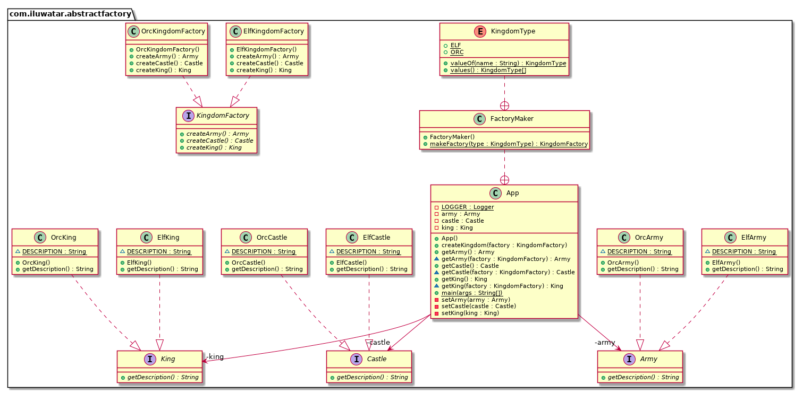

# Abstract Factory

Tags: gang of four(四人帮)

Category: 创建型

## 众所周知

工具包

## 意图

提供一个接口，不用指定具体的类来创建一系列相关的对象

## 解释

真实世界的例子：

> 创建一个王国都有一些相同的地方，比如精灵王国需要精灵王，精灵城堡，精灵军队
> 创建一个兽人王国需要兽人王，兽人城堡，兽人军队，国王的对象之间存在依赖关系

简单来说：
> 工厂的工厂，将单个但相关的依赖的工厂组合在一起而不是指定他们具体的类工厂。

维基百科
> 抽象工厂的设计模式，提供了一种方式去组装一组具有相同主题的工厂，而不用指定具体的类

代码实现：

指定一个类接口，去创建具体的对象。

## 类图

## 适用场景

- 系统应该保持独立，无论产品怎么创建组装和表示
- 系统可以通过配置一个或多个产品
- 一系列相关的产品对象被设计出来应该是一起使用，你应该遵守这个约束。
- 你想提供一组产品类库，你仅仅只想展示接口而不是具体实现
- 依赖的生命周期在概念上比消费者短
- 你需要在运行时去构造一个特定的依赖
- 你想要在运行时去调用哪个产品
- 只需要提供极少数的参数给外部的依赖
- 当产品是一致的
- 当你新增一个产品时候，不用修改原有代码

典型例子

- 选择调用相似的实现，比如NetworkAcmeService，FileSystemAcmeService
- 单元测试编写的更加容易
- 不同操作系统的UI工具包

后果

- DI 在Java中，可能出现运行时的异常，而不是在编译中
- 虽然该模式在创建一个预定义的对象非常有用，但是添加一个新对象将会面临挑战
- 代码将会变得复杂，因为会增加很多类和接口

