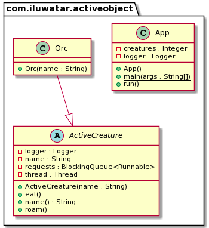

# Active Object(活动对象)

Tags: `性能`

分类：`并发`

## 意图

活动对象设计模式将方法的调用和方法的执行隔离，每个对象都驻留在其控制线程中。通过
调度处理请求和异步调用来解决并发问题。

## 解释

这个模式的类包含一个自同步机制但是没有包含同步方法。

真实世界的例子：

> 兽人有着坚强的意志和不屈的灵魂，它看起来有一组线程控制着他们的行为

实现一个生物拥有自我控制机制并且只暴露它自己的API，而不是执行他本身，我们可以使用ActiveObject设计模式。

编程例子:

参考 [ActiveObjectCode](../src/ActiveObject)

类图：

指南:

[Android and Java Concurrency: The Active Object Pattern](https://www.youtube.com/watch?v=Cd8t2u5Qmvc)

