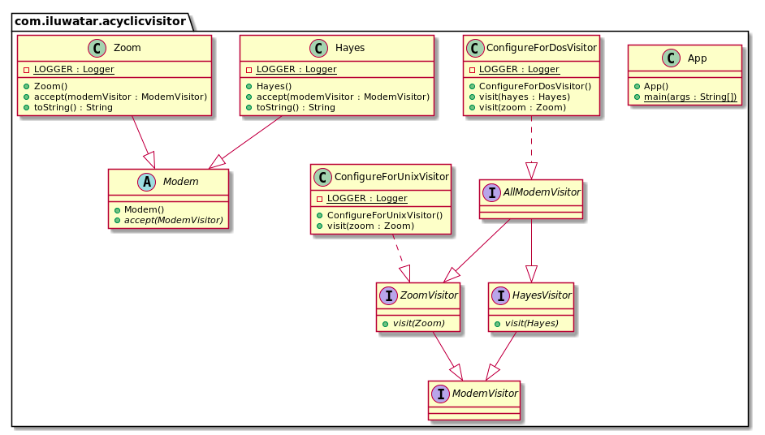

[# Acyclic Visitor (无环访问者模式)

Tags: `扩展性`

分类: `行为型`

## 意图

允许新功能添加到一个存在的类层次结构中而不用影响现有的结构，
并且不会存在GOF访问者模式固有循环依赖的问题。

## 解释

真实世界的例子

> 我们又一个调制解调器，调制解调器需要被访问通过一个扩展的算法基于过滤器（比如Unix或者DOS兼容的）

简单来讲

> 无环访问者模式允许功能被动态的添加存在的类结构中而不用修改原有的结构

Wiki百科

> 无环访问者模式允许功能被动态的添加存在的类结构中而不用修改原有的结构，并且没有创建GOF Visitor Pattern固有的循环依赖

编程例子:

[代码路径](../src/AcyclicVisitor)

类图:

## 适用性

这个模式可以被用于:

- 当你需要需增加一个新的功能给一个存在的类，并且不能去修改原有的继承结构
- 当存在对层次结构进行操作但不属于层次结构本身的功能时
- 当你需要根据对象的类型执行不同的操作时
- 当被访问的类需可能被频繁的扩展的时候
- 重新编辑，重新链接，重新发布某一个类的变得非常困难的时候

## 结果

好的方面
- 没有依赖环在类继承结构中
- 不需要重新编译所有的访问者当一个新的访问者添加进来
- 如果类有一个新的字段将不会导致现有的访问者失败

坏的方面
- 违反里式替换原则，本来显示可以接受所有的访问者，但实际上只有一个访问者可以处理
- 必须为可访问类层次结构中的所有成员创建访问者的并行层次结构