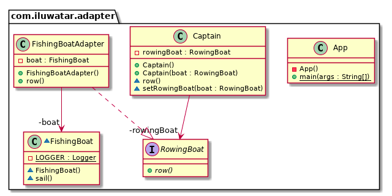

# Adapter 适配器

Tags: `Gang of four`

分类: `结构型`

## 众所周知

墙纸

## 意图

转换接口为客户端想要的另外一种接口，适配器可以因为接口不兼容的类一起工作。

## 解释

真实世界的例子

> 电源适配器，图片转换器

一句话解释

> 适配器可以包装一个不兼容的对象为另外一个兼容的对象

wiki百科

> 软件工程中，适配器模式是一个软件设计模式，它可以允许已经存在的类被另外一个接口使用。
> 它经常用在让已经存在的类可以正常用而不用修改原有的代码

编程例子

[src/Adapter](../src/Adapter)

## 类图

## 适用场景

- 你想使用一个已经存在的类，它的接口和你想使用的不匹配
- 你想创建一个可重复使用的类，即不一定具有兼容接口的类
- 你需要使用一系列已经存在的子类来调整接口是不现实的，对象适配器可以适配其父类接口
- 绝大多数应用使用第三方包，使用适配器作为一个中间层，如果增加了一个中间库，只需要增加一个适配器即可，而不用去改变应用的代码。

## 后果

类适配器

- 适配器通常只能适配某一个类，结果是，它不能适配所有的子类
- 适配器重写了适配者的行为，所以适配器是适配者的子类
- 假设只有一个对象，并且不需要额外的指针来适配

对象适配器

- 能适配所有的子类，增加一个功能可以给所有的适配者使用
- 重写Adaptee行为变得困难，Adapter依赖的是Adaptee的子类，而不是Adaptee自己。

## 真实例子

`Arrays.asList()`
`Collections.list()`
